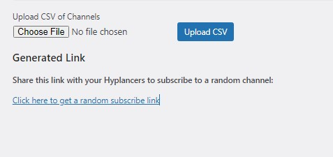

# YouTube Subscribe Link Generator

A WordPress plugin to generate random subscribe links from a CSV of YouTube channels, ensuring each channel is shown only once per week.

## Description

The YouTube Subscribe Link Generator plugin allows you to upload a CSV file containing YouTube channel URLs. The plugin then generates random subscribe links from the uploaded channels, ensuring that each channel is shown only once per week to users. This helps in distributing the subscription links evenly over time.

## Features

- Upload a CSV file of YouTube channels via the WordPress admin dashboard.
- Generate a unique subscribe link for each channel.
- Ensure each channel is shown only once per week.
- Users can get a random subscribe link from the available channels.
- Automatically reset the viewed channels every week.

## Installation

1. Download the plugin and upload it to your WordPress site's `/wp-content/plugins/` directory.
2. Activate the plugin through the 'Plugins' menu in WordPress.
3. Go to the 'YouTube Subscribe' menu in the WordPress admin dashboard to upload your CSV file and manage the plugin.

## Usage

1. **Upload CSV of Channels:**
   - Navigate to the 'YouTube Subscribe' menu in the WordPress admin dashboard.
   - Upload a CSV file containing the list of YouTube channels. The CSV file should have two columns: the first for the channel name and the second for the channel URL.

2. **Generate Subscribe Link:**
   - After uploading the CSV file, the plugin will parse the channels and generate subscribe links.
   - Users can visit `[Your Site URL]/random-subscribe-link` to get a random subscribe link.
   - The plugin ensures that each channel is shown only once per week to the users.

## Screenshots

1. **Admin Page for Uploading CSV**  
   

## Changelog

### 1.0
- Initial release

## Author

**James-Hart Kingsley**  
- [LinkedIn](https://www.linkedin.com/in/kingsley-james-hart-93679b184/?originalSubdomain=ng)

## License

This plugin is licensed under the GPL-2.0+ license. See the LICENSE file for more details.
